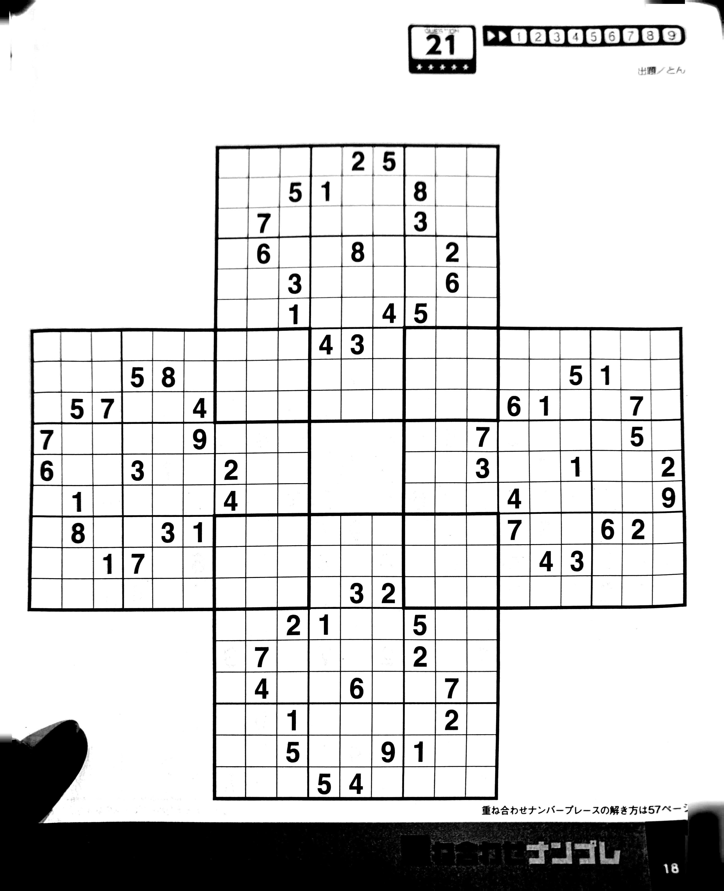

# Combo-sudoku board instruction

## Overview

This puzzle is a variation of traditional sudoku puzzle. A normal sudoku puzzle has a 9x9 board, subdivided into 3x3 square areas, where every area is a 3x3 square called a room(thus 9 cells). The player has to fill up all cells with numbers from 1-9 with the constraints defined in the [rule](rule.md). In combo-sudoku, the basic set up is similar but the board might contains multiple sudoku 9x9 sub-boards, each one collide with others. As a result, numbers filled has to satisfy every sudoku sub-board's constraints.

## Schema



A JSON-representation of the combo-sudoku board can be as follow:

```json
{
    "subboards": [
        {
            "x": 2,
            "y": 0,
            "hints": [
                [0, 0, 0, 0, 2, 5, 0, 0, 0],
                [0, 0, 5, 1, 0, 0, 8, 0, 0],
                [0, 7, 0, 0, 0, 0, 3, 0, 0],
                [0, 6, 0, 0, 8, 0, 0, 2, 0],
                [0, 0, 3, 0, 0, 0, 0, 6, 0],
                [0, 0, 1, 0, 0, 4, 5, 0, 0],
                [0, 0, 0, 4, 3, 0, 0, 0, 0],
                [0, 0, 0, 0, 0, 0, 0, 0, 0],
                [0, 0, 0, 0, 0, 0, 0, 0, 0]
            ]
        },
        {
            "x": 0,
            "y": 2,
            "hints": [
                [0, 0, 0, 0, 0, 0, 0, 0, 0],
                [0, 0, 0, 5, 8, 0, 0, 0, 0],
                [0, 5, 7, 0, 0, 4, 0, 0, 0],
                [7, 0, 0, 0, 0, 9, 0, 0, 0],
                [6, 0, 0, 3, 0, 0, 2, 0, 0],
                [0, 1, 0, 0, 0, 0, 4, 0, 0],
                [0, 8, 0, 0, 3, 1, 0, 0, 0],
                [0, 0, 1, 7, 0, 0, 0, 0, 0],
                [0, 0, 0, 0, 0, 0, 0, 0, 0]
            ]
        },
        {
            "x": 4,
            "y": 2,
            "hints": [
                [0, 0, 0, 0, 0, 0, 0, 0, 0],
                [0, 0, 0, 0, 0, 5, 1, 0, 0],
                [0, 0, 0, 6, 1, 0, 0, 7, 0],
                [0, 0, 7, 0, 0, 0, 0, 5, 0],
                [0, 0, 3, 0, 0, 1, 0, 0, 2],
                [0, 0, 0, 4, 0, 0, 0, 0, 9],
                [0, 0, 0, 7, 0, 0, 6, 2, 0],
                [0, 0, 0, 0, 4, 3, 0, 0, 0],
                [0, 0, 0, 0, 0, 0, 0, 0, 0]
            ]
        },
        {
            "x": 2,
            "y": 4,
            "hints": [
                [0, 0, 0, 0, 0, 0, 0, 0, 0],
                [0, 0, 0, 0, 0, 0, 0, 0, 0],
                [0, 0, 0, 0, 3, 2, 0, 0, 0],
                [0, 0, 2, 1, 0, 0, 5, 0, 0],
                [0, 7, 0, 0, 0, 0, 2, 0, 0],
                [0, 4, 0, 0, 6, 0, 0, 7, 0],
                [0, 0, 1, 0, 0, 0, 0, 2, 0],
                [0, 0, 5, 0, 0, 9, 1, 0, 0],
                [0, 0, 0, 5, 4, 0, 0, 0, 0]
            ]
        }
    ]
}
```

### Explanation

- `subboards`: Denoting each room's metadata.
- `subboards.x` & `subboards.y`: This means the leftmost, topmost room's location within the combo-sudoku's board. Coordinate (0, 0) means the leftmost, topmost position.
- `subboards.hint`: This means the existing number hints in the first place. 0 means no hint, and shall be filled by the players.